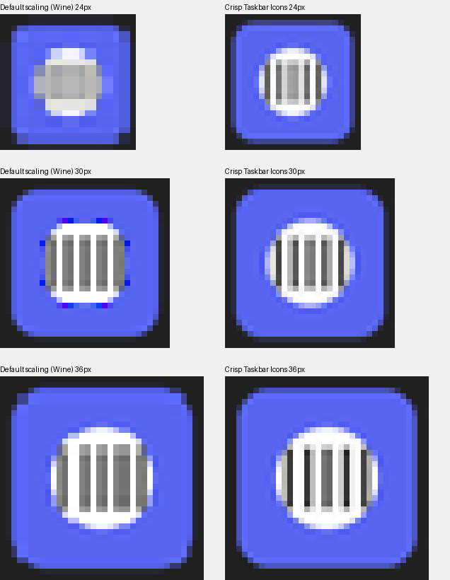

# icoreso — Crisp Taskbar Icons

A [Windhawk](https://windhawk.net) mod for Windows 10/11 that makes taskbar
icons (pinned shortcuts and running apps such as File Explorer, Discord,
Steam, …) sharp instead of blurry or pixelated.

## Why taskbar icons look blurry

Most apps ship a 256×256 image in their `.ico`/`.exe`, but Windows rarely uses
it for the taskbar:

| Situation | What Windows does | Result |
|---|---|---|
| Taskbar needs 30 px (125% scaling), icon has 16/32/48/256 | Takes the **32 px** image and shrinks it 6% | Every edge smeared over 2 px |
| Running app sends a 32 px window icon, taskbar needs 36 px (150%) | **Upscales** 32 → 36 | Soft and pixelated |
| `DrawIconEx` / `CopyImage` stretching | Nearest-neighbour style sampling | Jagged edges |

## What the mod does

Inside `explorer.exe` (which hosts the taskbar) it hooks:

- **`PrivateExtractIconsW` / `LoadImageW`** – when the exact size isn't in the
  icon file, re-render it from a much larger image (by default the smallest one
  ≥ 2× the target, usually the 256 px image) with a Lanczos-3 filter in
  premultiplied alpha. Exact sizes are left untouched.
- **`WM_GETICON` (`SendMessage*`) / `GetClassLongPtrW`** – when a running app
  hands the taskbar an icon smaller than the taskbar's real pixel size, swap in
  the app's own exe icon rendered at the exact size. A pixel comparison makes
  sure the window icon really is the exe icon, so custom/dynamic icons are
  never replaced.
- **`DrawIconEx` / `CopyImage`** – resample stretched icons with the
  high-quality filter.

No files on disk are modified.

## Install

1. Install [Windhawk](https://windhawk.net).
2. *Create a new mod*, replace the template with
   [`mods/taskbar-crisp-icons.wh.cpp`](mods/taskbar-crisp-icons.wh.cpp), then
   *Compile* and *Enable*.
3. Clear Explorer's icon cache once so already-cached blurry icons are
   regenerated: run `ie4uinit.exe -show`, or delete
   `%LocalAppData%\Microsoft\Windows\Explorer\iconcache_*.db`, then restart
   Explorer (Task Manager → Windows Explorer → Restart).

### Settings

| Setting | Default | |
|---|---|---|
| Re-render shortcut, pinned and file icons | on | |
| Upgrade low-resolution running app icons | on | |
| High-quality icon stretching | on | |
| Taskbar icon size | 24 | Logical px at 100%; use 16 for small taskbar buttons |
| Source image preference | Auto | Auto / nearest larger / largest |
| Resampling filter | Lanczos-3 | Lanczos-3, Catmull-Rom, Mitchell, area average |

## Limitations

- Detail that isn't in the icon file can't be created: an app that only ships
  a 32 px icon is upscaled smoothly, not sharpened.
- Store/UWP apps use scale-specific PNG assets and are unaffected.

## Tests

`tests/run_tests.sh` cross-compiles the rendering pipeline with MinGW and runs
it under Wine (needs `mingw-w64`, `wine`, Python + Pillow). It checks `.ico`
and PE icon-group parsing, source-image selection, the hooked
`LoadImageW`/`PrivateExtractIconsW`/`CopyImage`/`DrawIconEx` paths and the
resampler.
